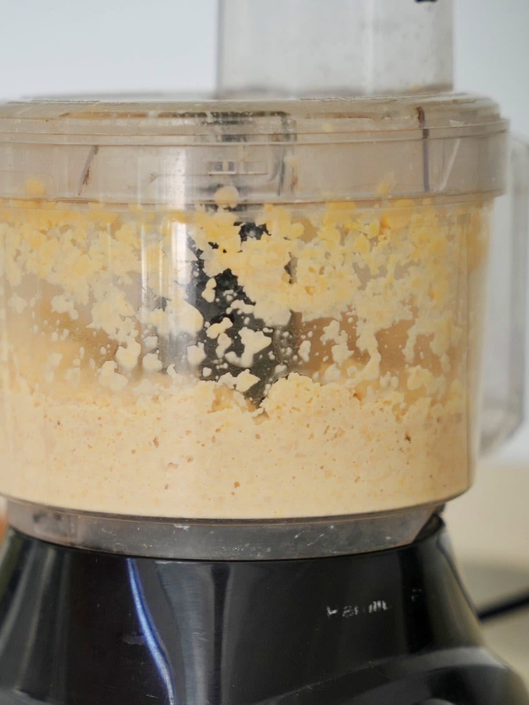
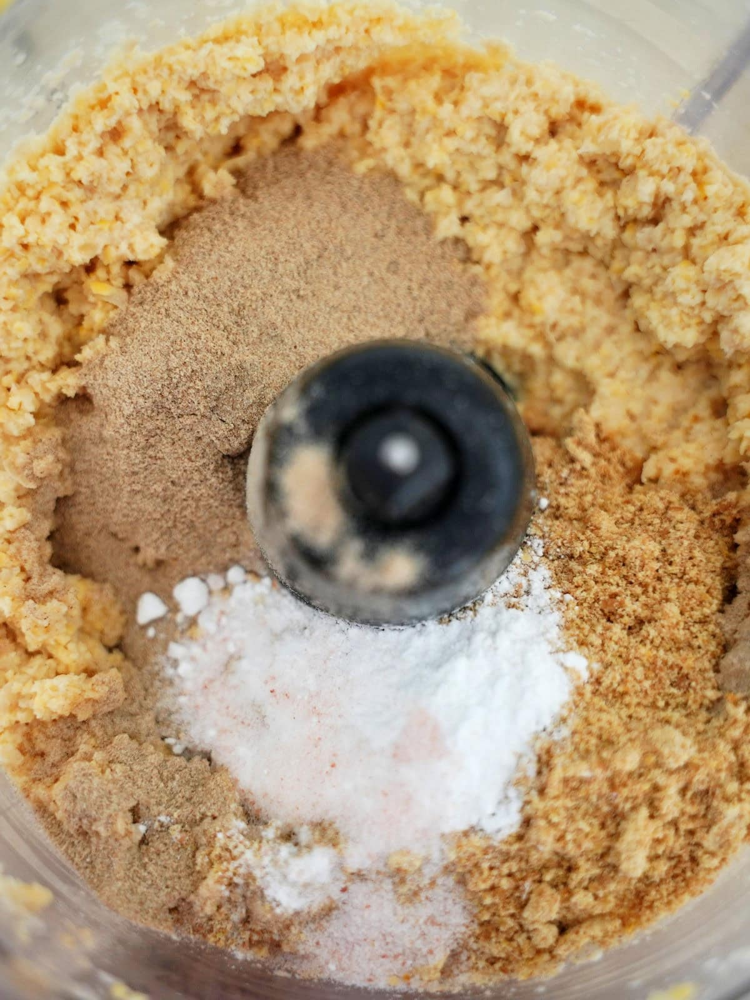
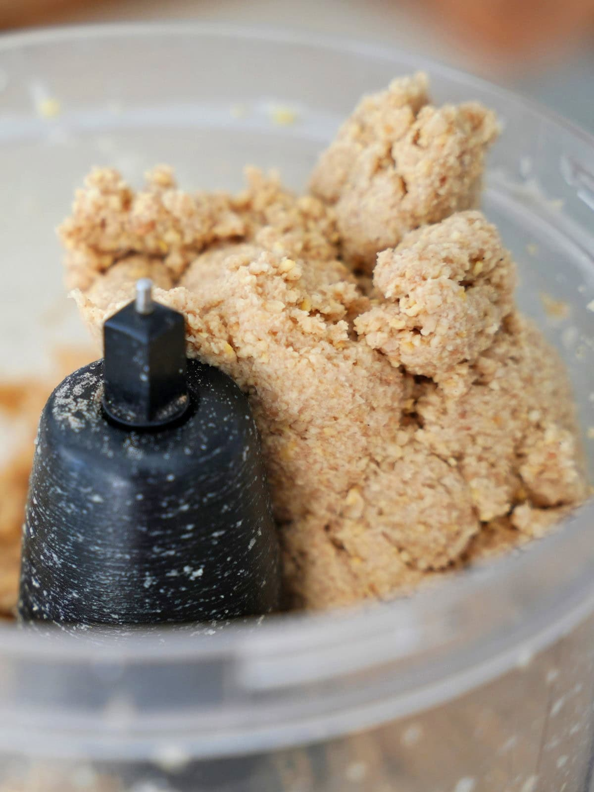
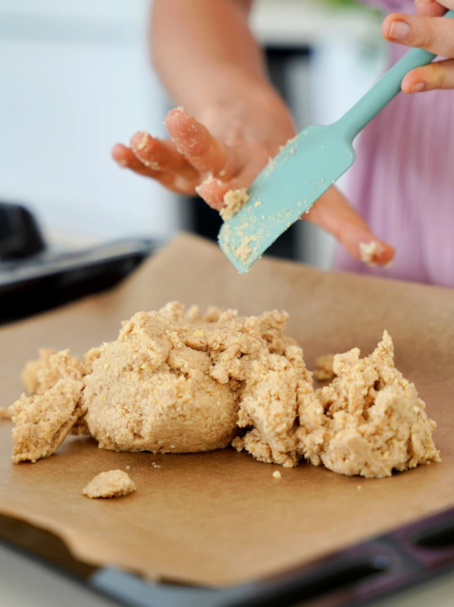
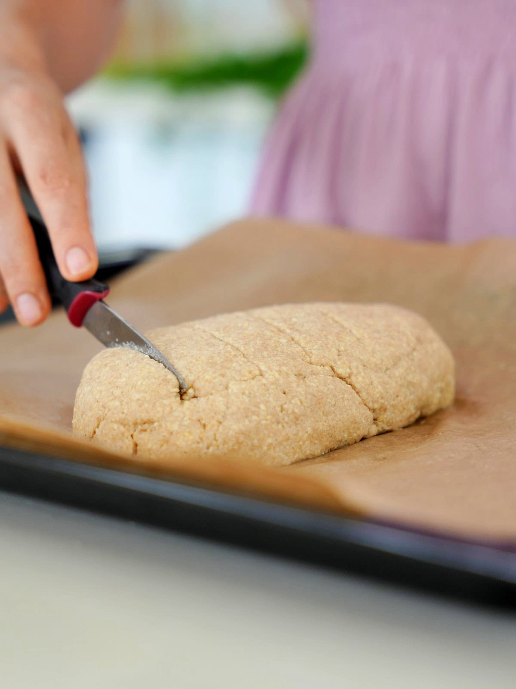
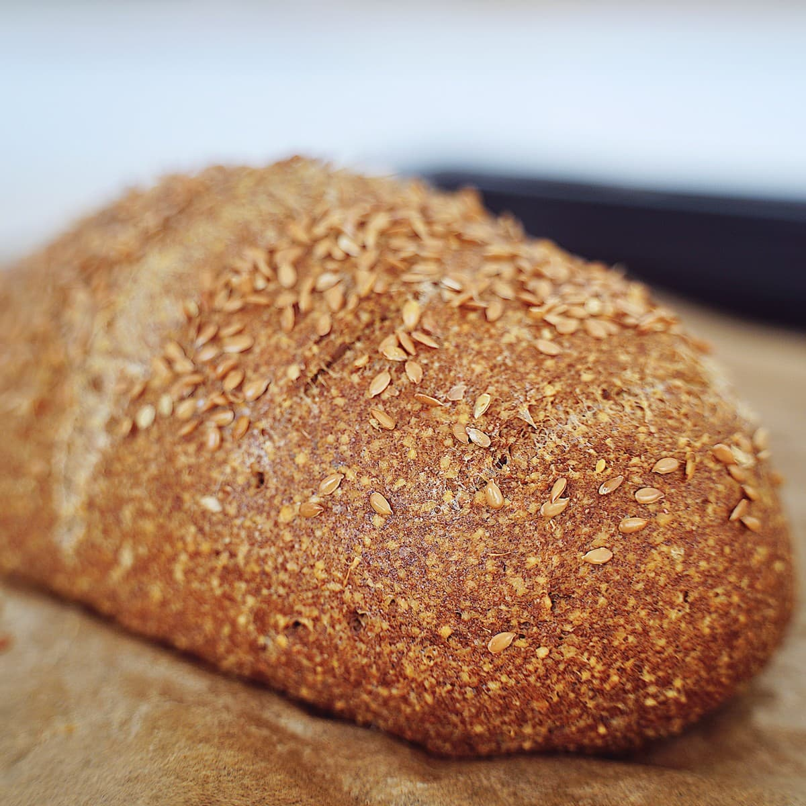
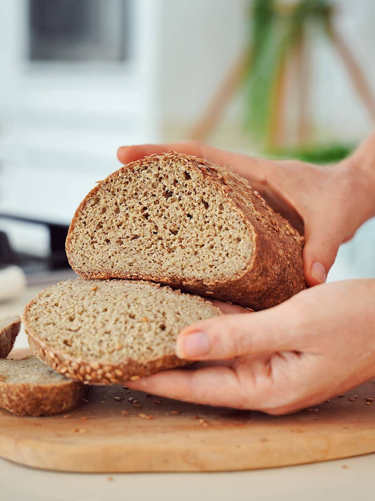
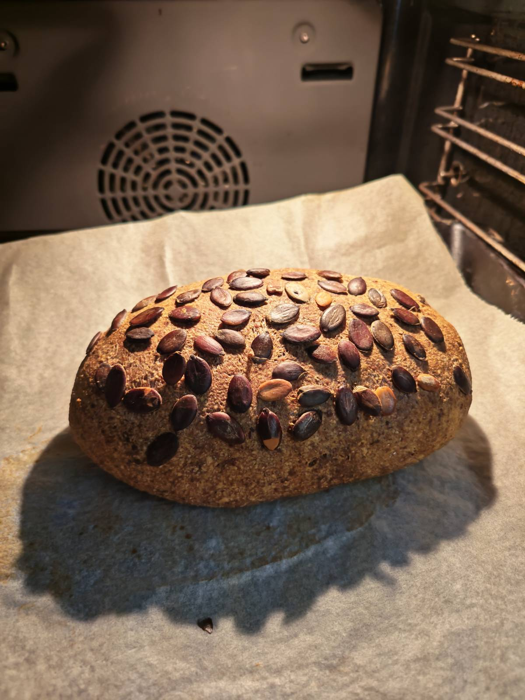

# Hleb od leblebija

- Datum: 2026-02-03
- Izvor: [Ela Vegan](https://elavegan.com/chickpea-bread) ([video](https://www.youtube.com/watch?v=3vrRHtb8O7o))

## Sastojci

| Količina |    Mera     |                               Naziv                                |
| -------: | ----------- | ------------------------------------------------------------------ |
|      200 | g           | suva leblebija (ne iz konzerve) – oko 400 g nakon potapanja 9 sati |
|      180 | ml          | voda                                                               |
|       40 | g           | prah od psilijum ljuspica (ne cele ljuspice)                       |
|       25 | g           | mleveno laneno seme                                                |
|        5 | g           | so                                                                 |
|      1.5 | tsp         | prašak za pecivo                                                   |
|     0.75 | tsp         | soda bikarbona                                                     |
|      1.5 | tbsp (16 g) | sirće ili sok od limuna / limete                                   |

## Priprema

1. Potopiti leblebije preko noći (9–12 sati) u obilju vode, dok se vidno ne uveća i približno ne udvostruči težinu. Zatim dobro ocediti i isperati.
2. Zagrejati rernu na 200°C i obložiti pleh papirom za pečenje.
3. U multipraktiku izmiksati leblebije i vodu dok se dobije glatka smesa.
4. Dodati mleveno laneno seme, psilijum prah, prašak za pecivo i sodu bikarbonu. Zatim sipati sirće direktno preko praška za pecivo i sode.
5. Ponovo dobro izmiksati. Smesa se zgušnjava u periodu od 30ak sekundi i procesor jedva vrti koliko je gusto.
6. Prebaciti testo na pleh i rukama oblikovati okrugli hleb, blago kvaseći ruke kako bi se zagladila površina i ivice. Zarezati vrh nožem, površinu ponovo blago nakvasiti, po želji posuti semenkama.
1. Peći 60 minuta.
8. Ostaviti hleb da se potpuno ohladi (inače je gnjecav unutra)

## Napomene

1. Ne može da se koristi leblebija u konzervi jer je iscureo sav skrob u vodu, a on omogućava strukturu
1. Psilijum ljuspice ne mogu da se koriste umesto praha, bude gnjecav hleb unutra
1.

### Nutritivne vrednosti

**Hleb od leblebija (bez glutena, bez kvasca)**

|         Nutritivna vrednost         | Količina na 100 g |
| ----------------------------------- | ----------------- |
| Energija                            | ~170 kcal         |
| Masti                               | ~4,5 g            |
| &nbsp;&nbsp;od kojih zasićene masti | ~0,7 g            |
| Ugljeni hidrati                     | ~18 g             |
| &nbsp;&nbsp;Šećeri                  | ~1,2 g            |
| &nbsp;&nbsp;Vlakna                  | ~11 g             |
| &nbsp;&nbsp;Neto ugljeni hidrati    | **~7 g**          |
| Proteini                            | ~8,5 g            |
| Natrijum                            | ~400 mg           |

### Slike

