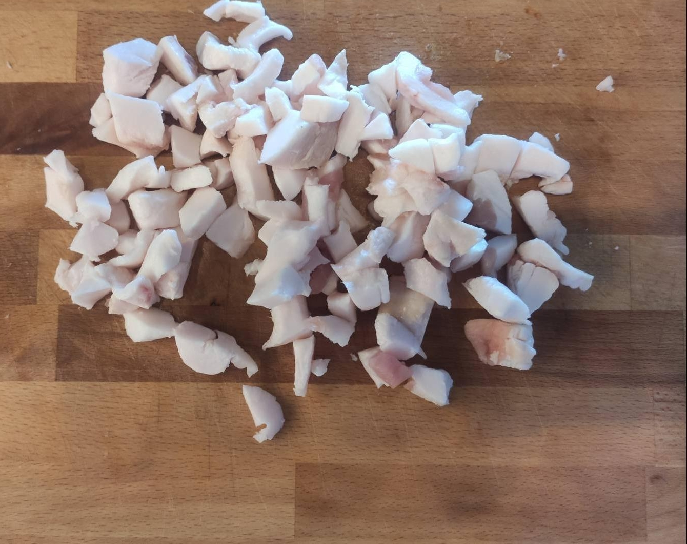
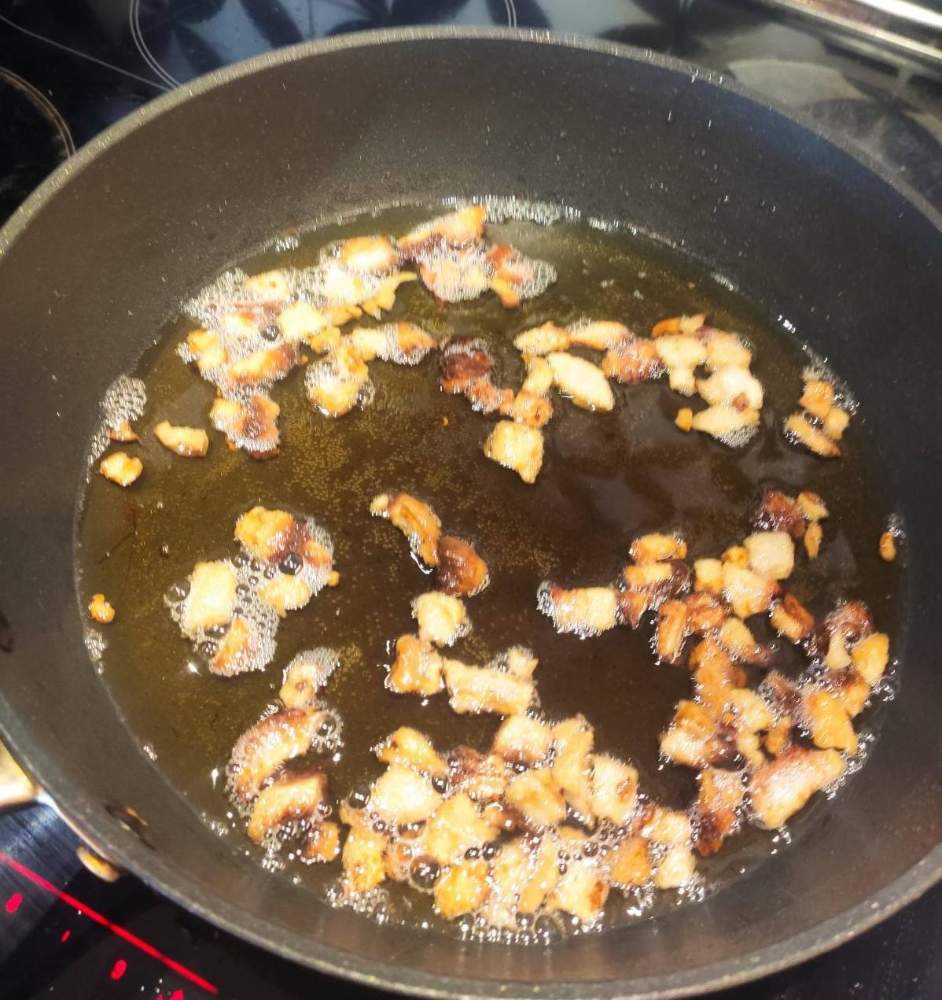
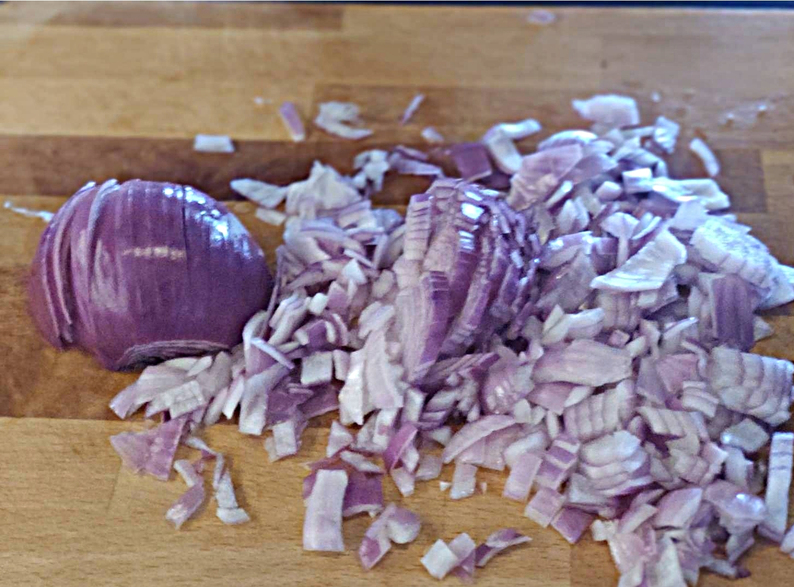
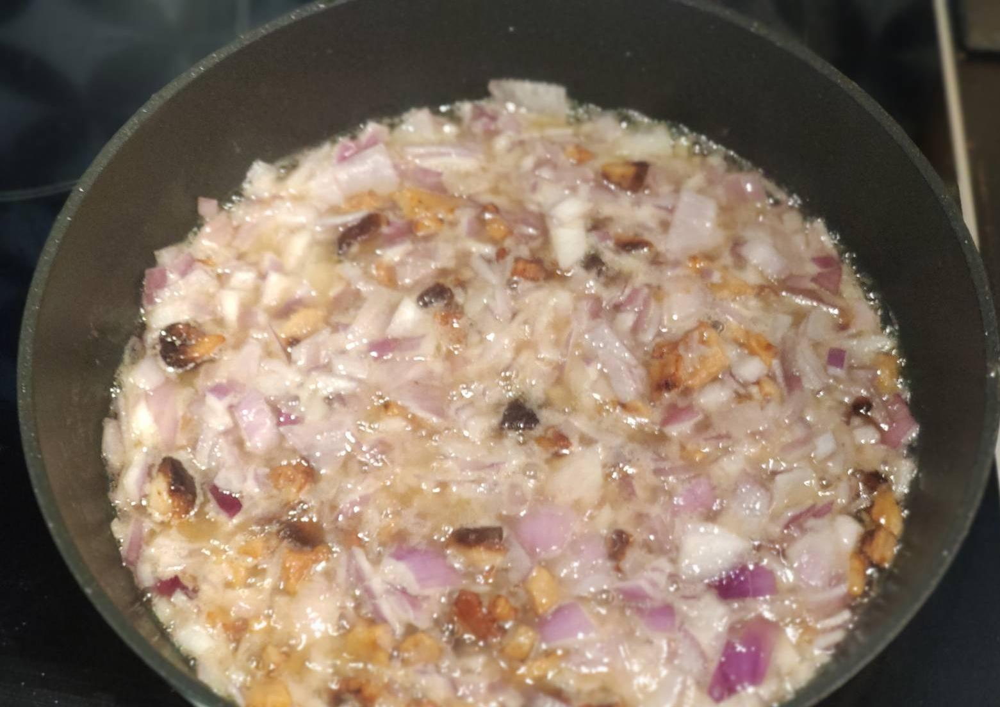
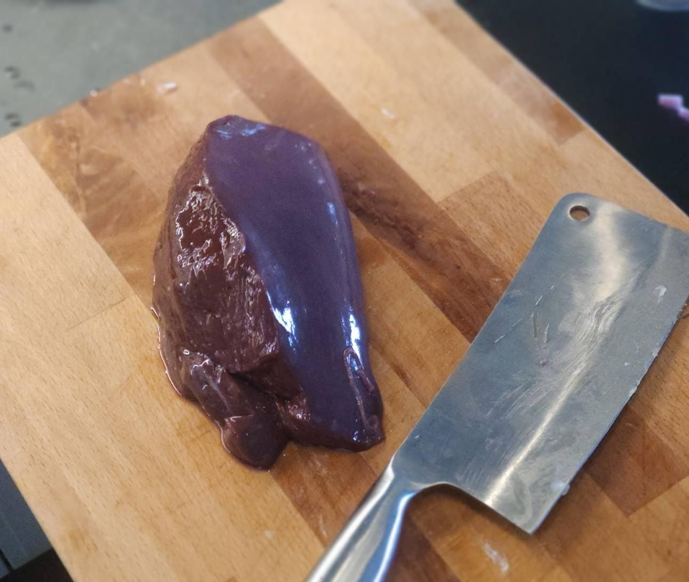
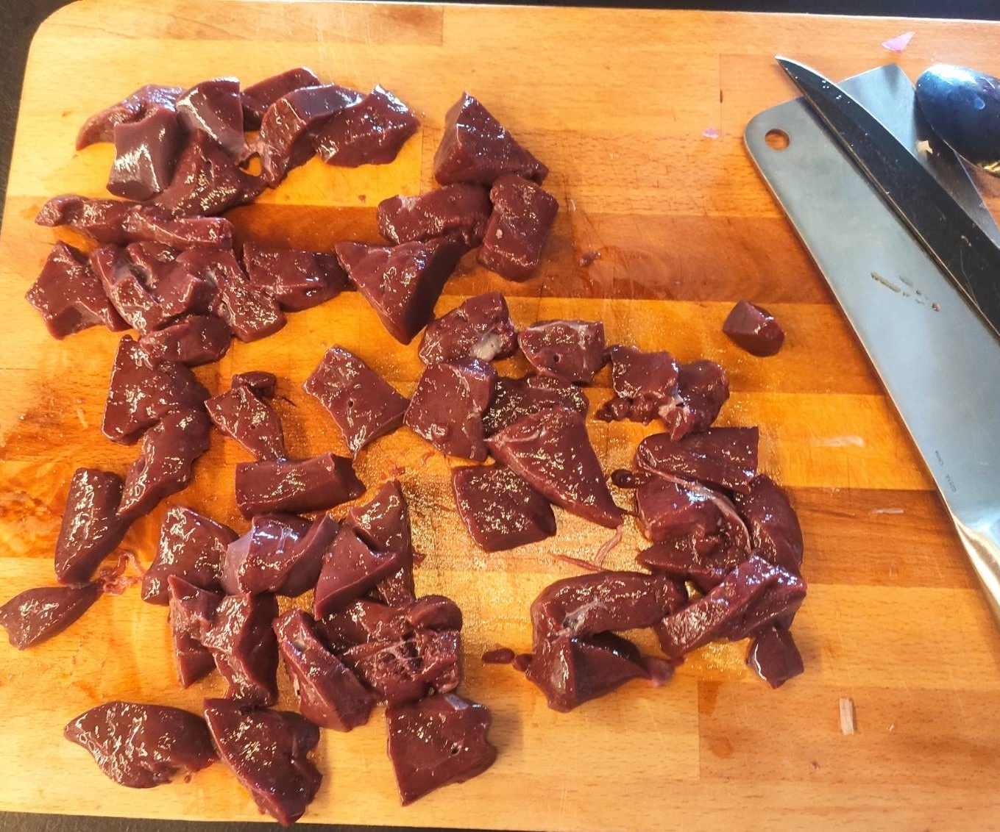
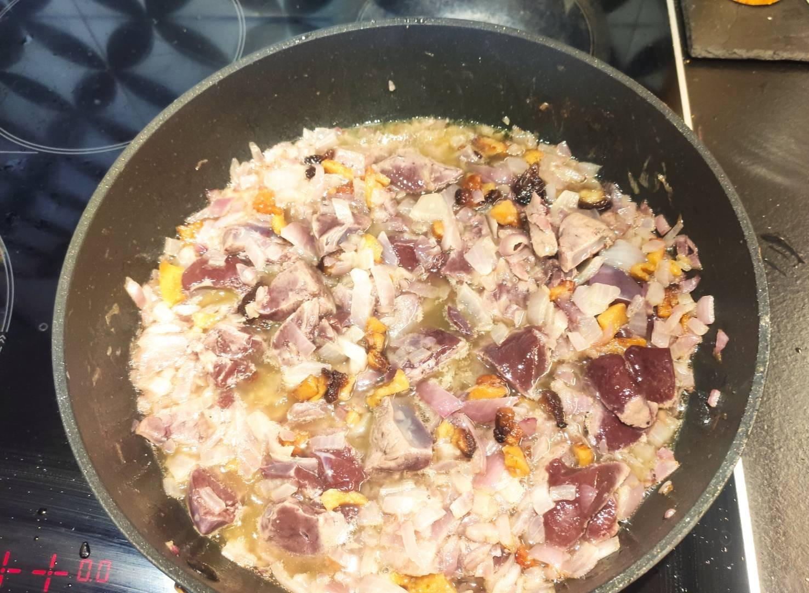
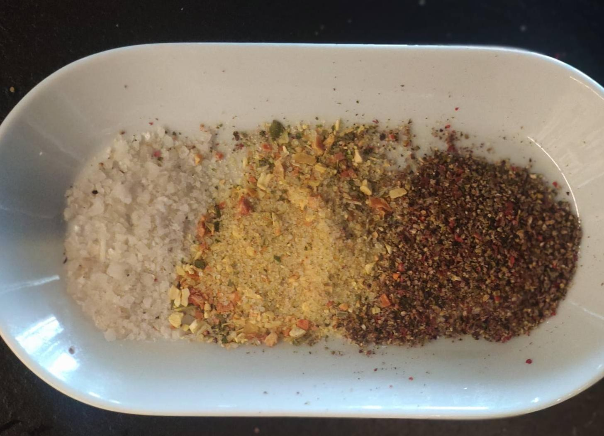
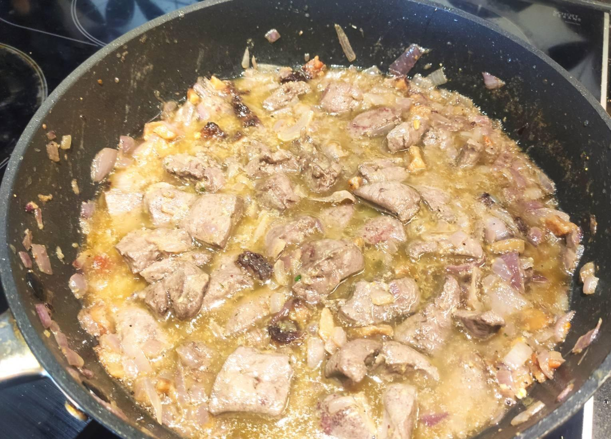

# Domaća pašteta

| Količina | Mera |     Sastojak     |
| -------- | ---- | ---------------- |
| 300      | g    | živa slanina     |
| 500      | g    | juneća džigerica |
| 500      | g    | crni luk         |R
| 1        | tsp  | senf             |
|          |      | biber            |
|          |      | so               |
|          |      | vegeta           |

1. Sitno iseckati slaninu na kockice i propržiti tako da ostanu čvarčići
1. Dodati sitno seckani luk.
1. Kada je luk pržen doda se džigerica
1. Začiniti po želji
1. Nakon što je sve gotovo obradi se super seckom

*Izvor*: Danica Milić

---

